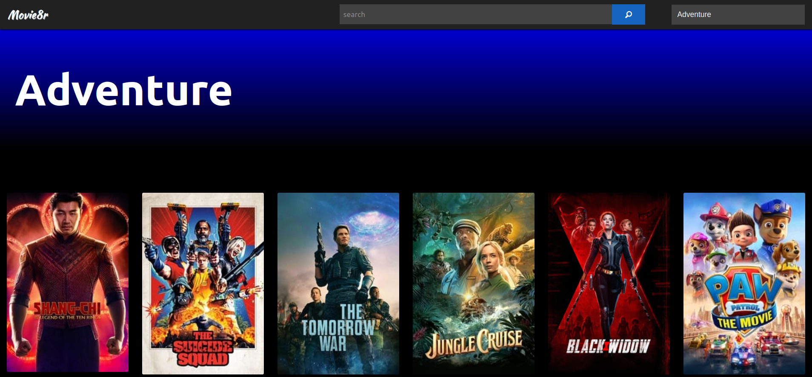

# Movie8r
> A movie library integrated with IMDb that includes "Watch Now" functionality out-of-the-box.

Utilizes the [The Movie Database (TMDB)](https://www.themoviedb.org/?language=en-US) api to put over 700,000 movies and TV shows at your fingertips.



## Prerequisites
Make sure you have installed all of the following prerequisites on your development machine:
* Git - [Download & Install Git](https://git-scm.com/downloads). OSX and Linux machines typically have this already installed.
* Node.js - [Download & Install Node.js](https://nodejs.org/en/download/) and the npm package manager. If you encounter any problems, you can also use this [GitHub Gist](https://gist.github.com/isaacs/579814) to install Node.js.
* TMDB api key - Create a TMDB account at [themoviedb.org/signup](https://www.themoviedb.org/signup). Once logged in, your api key can be found at [themoviedb.org/settings/api](https://www.themoviedb.org/settings/api).

## Installation
Clone the project and install dependencies.

```sh
git clone https://github.com/koressel/movie8r.git movie8r
cd movie8r
npm install
```

## Development setup
Add your TMDB api key to a file named .env in the root directory.

```sh
# .env
TMDB_API_KEY=<<YourApiKey>>
```
Then start the application with 
>npm start

## Meta
Taylor Koressel – [LinkedIn](https://www.linkedin.com/in/taylorkoressel/) – koressel.dev@gmail.com

Distributed under the XYZ license. See ``LICENSE`` for more information.

[https://github.com/koressel](https://github.com/koressel/)

## Contributing
1. Fork it (<https://github.com/yourname/yourproject/fork>)
2. Create your feature branch (`git checkout -b feature/fooBar`)
3. Commit your changes (`git commit -am 'Add some fooBar'`)
4. Push to the branch (`git push origin feature/fooBar`)
5. Create a new Pull Request

<!-- Markdown link & img dfn's -->
[npm-image]: https://img.shields.io/npm/v/datadog-metrics.svg?style=flat-square
[npm-url]: https://npmjs.org/package/datadog-metrics
[npm-downloads]: https://img.shields.io/npm/dm/datadog-metrics.svg?style=flat-square
[travis-image]: https://img.shields.io/travis/koressel/node-datadog-metrics/master.svg?style=flat-square
[travis-url]: https://travis-ci.org/koressel/node-datadog-metrics
[wiki]: https://github.com/yourname/yourproject/wiki
