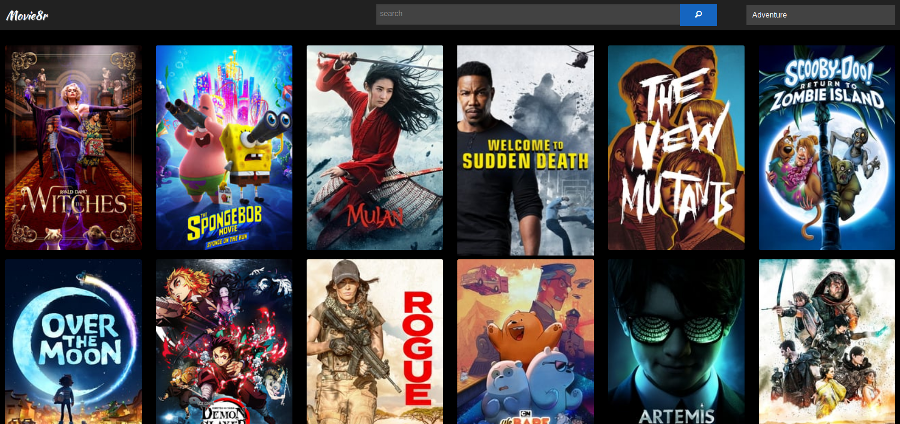

# Movie8r
> A movie library integrated with IMDb that includes "Watch Now" functionality out-of-the-box.

[![NPM Version][npm-image]][npm-url]
[![Build Status][travis-image]][travis-url]
[![Downloads Stats][npm-downloads]][npm-url]

Utilizes the [The Movie Database (TMDB)](https://www.themoviedb.org/?language=en-US) api to put over 700,000 movies and TV shows at your fingertips.



## Installation

Clone the project and install dependencies.

```sh
git clone https://github.com/koressel/movie8r.git movie8r
cd movie8r
npm install
```

## Development setup

Add your TMDB api key to a file named .env in the root directory.

```sh
# .env
TMDB_API_KEY=<<YourApiKey>>
```
Then start the application with 
>npm start

## Meta

Taylor Koressel – [LinkedIn](https://www.linkedin.com/in/taylorkoressel/) – koressel.dev@gmail.com

Distributed under the XYZ license. See ``LICENSE`` for more information.

[https://github.com/koressel](https://github.com/koressel/)

## Contributing

1. Fork it (<https://github.com/yourname/yourproject/fork>)
2. Create your feature branch (`git checkout -b feature/fooBar`)
3. Commit your changes (`git commit -am 'Add some fooBar'`)
4. Push to the branch (`git push origin feature/fooBar`)
5. Create a new Pull Request

<!-- Markdown link & img dfn's -->
[npm-image]: https://img.shields.io/npm/v/datadog-metrics.svg?style=flat-square
[npm-url]: https://npmjs.org/package/datadog-metrics
[npm-downloads]: https://img.shields.io/npm/dm/datadog-metrics.svg?style=flat-square
[travis-image]: https://img.shields.io/travis/koressel/node-datadog-metrics/master.svg?style=flat-square
[travis-url]: https://travis-ci.org/koressel/node-datadog-metrics
[wiki]: https://github.com/yourname/yourproject/wiki
